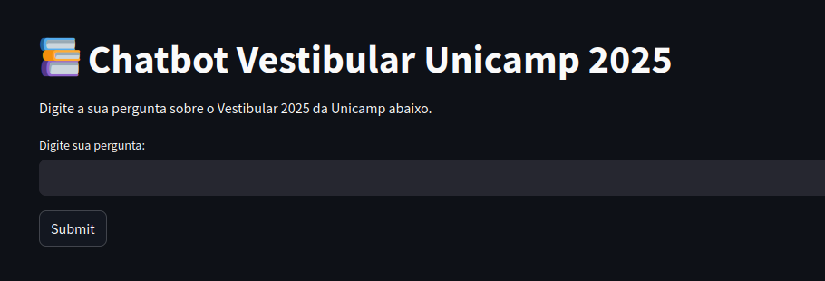

# Chatbot para auxiliar alunos com perguntas em relação ao vestibular da Unicamp 2025

Esse projeto foi desenvolvido como uma das etapas do proceso de estágio na [Neuralmind](https://neuralmind.ai/en/home-en/). O objetivo do projeto foi desenvolver um chatbot que, utilizando Retrieval-Augmented Generation (RAG), consiga responder dúvidas acerca da [Resolução GR-029/2024](https://www.pg.unicamp.br/norma/31879/0), documento contendo informações gerais acerca do vestibular. 


## Uso

O deploy do chatbot foi realizado utilizando o streamlit, e está disponível para ser testado em https://chatbotunicamp2025.streamlit.app/



Para o uso local, basta executar:

```python
 pip install requirements.txt
```

```python
cd app
 ```

```python
streamlit run main.py
 ```
---


## Estrutura de arquivos
O desenvolvimento da aplicação foi baseado em 4 diretórios principais:
- **app**: Realizar o deploy da aplicação e funções para encontrar documentos mais relevantes e gerar resposta
- **data**: Armazenar dados para o processo de transformação de texto e recuperação de contexto
- **pre-processing**: Raspagem dos dados da página oficial e criação da vector store
- **evaluation**: Aplicação de métricas para avaliação do modelo.
```
├── app/ 
│   ├── main.py         # Deploy da aplicação
│   ├── query.py        # Geração das respostas
├── data/
│   ├── faiss_index/    # Vector store
│   ├── tables/         # Arquivos .csv das tabelas
│   ├── text/           # Texto da Resolução e tabelas
│   ├── images/         # Imagens utilizadas no relatório
├── evaluation/
│   ├── analysis.py     # Obtenção da médias das métricas
│   ├── data/           # Tabelas geradas para obter métricas
│   ├── get_metrics.py  # Obtenção das métricas de avaliação
├── pre_processing/
│   ├── scraping.py     # Obtenção dos dados da página HTML
│   ├── vector_space.py # Criação dos embeddings e Vector Store
├── README.md 
├── requirements.txt
```


## Pipeline

#### 1. Coleta e Processamento de Dados
Como etapa inicial do desenvolvimento do projeto, foi necessário obter os dados relacionados à Resolução. Para isso, foi utilizada a biblioteca **requests** para realizar as requisições *HTTP*, e a biblioteca **Beautiful Soup** para analisar os elementos *HTML*. Essa análise foi especialmente relevante no tratamento de tabelas, onde o Beautiful Soup permitiu separar as tabelas do texto original para processamento posterior.

Durante o processamento das tabelas, muitas delas apresentavam características que dificultavam sua interpretação, como células mescladas nos cabeçalhos. Para contornar essas limitações, convertemo-las em arquivos ```.csv``` com o auxílio do *ChatGPT*. Em seguida, transformamos os dados em texto corrido e armazenamos os resultados em um arquivo ```.txt```.

#### 2. Criação do Índice de Busca 
A separação do texto em chunks foi realizada por meio de duas abordagens distintas: uma aplicada ao texto completo e outra dedicada às tabelas extraídas. Para definir os chunks, foi utilizado o **Recursive Character Text Splitter**, do **LangChain**. No caso das tabelas, cada linha foi tratada como um chunk individual.

Para a geração das embeddings, foi utilizado o modelo **"all-MiniLM-L6-v2"**, disponível no **Hugging Face**, que oferece representações compactas e eficazes do texto.
Além disso, optamos por utilizar a **FAISS vector store** para armazenar e realizar buscas nas representações vetoriais, devido à sua eficiência na execução de consultas rápidas e escaláveis em grandes conjuntos de dados.

Por fim, unimos as representações vetoriais provenientes das diferentes fontes textuais (texto completo e tabelas) e armazenamos o resultado em um arquivo para ser consultado nas próximas etapas do processo.

#### 3. Recuperação de Contexto
Na etapa de recuperação do contexto, a pergunta do usuário é utilizada como *input*, e é realizada uma busca por similaridade na *vector store*. O objetivo é identificar e retornar os k *chunks* mais relevantes em relação à pergunta formulada. Essa estratégia garante que a resposta gerada seja fundamentada nas informações mais pertinentes disponíveis.

#### 4. Geração de Respostas
Nesta etapa, o modelo *GPT 4o-mini*, acessado via a *API* da **OpenAI**, é utilizado para gerar respostas baseadas nos chunks recuperados e na pergunta do usuário. O prompt foi elaborado combinando os *chunks* em um contexto estruturado e incluindo instruções para guiar o modelo, buscando respostas mais precisas. A resposta é construída a partir das saídas retornadas pelo modelo e apresentada ao usuário como resultado final.


## Avaliação do modelo
Para avaliar as respostas geradas pelo modelo, me baseei nas [perguntas mais frequentes](https://www.comvest.unicamp.br/faq-perguntas-frequentes/) do vestibular da Unicamp e, dentre essas, selecionamos e adaptamos algumas para alinhá-las melhor ao conteúdo apresentado na Resolução. A avaliação foi realizada utilizando a biblioteca [Ragas](https://docs.ragas.io/en/stable/), gerando um dataset contendo a pergunta, a resposta correta, a resposta gerada pelo *RAG* e o contexto obtido pela busca. Com esses dados, foi possível mensurar as métricas de corretude dos fatos, fidelidade dos fatos e similaridade semântica em relação à resposta ideal. Os resultados obtidos foram armazenados no arquivo *evaluation_results.csv*.

As métricas alcançadas foram:

- **Corretude dos fatos:** *13,81%*
- **Fidelidade:** *69,54%*
- **Similaridade semântica:** *85,81%*

Os resultados evidenciam que essas métricas estão fortemente relacionadas com a natureza das perguntas selecionadas. Como foi priorizado manter perguntas próximas às dúvidas gerais dos candidatos, muitas delas podem não ter sido abordadas diretamente na Resolução, o que impactou negativamente a corretude dos fatos. Entretanto, por meio de inspeção visual, constatamos que a aplicação obteve resultados satisfatórios ao responder questões baseadas em tabelas (como o NMO de um curso específico ou o número de vagas para ampla concorrência). Isso indica que a técnica utilizada para lidar com dados tabulares foi eficaz. Além disso, realizamos comparações entre o desempenho do *LLaMA 3 (70B)* e do *GPT-4o-mini*, e observamos que o *GPT* apresentou métricas mais robustas quando configurado com os parâmetros ideais.


## Melhorias e trabalhos futuros
Como melhorias, os principais pontos seriam trabalhar mais extensamente em testes para configurar parâmetros fundamentais para a avaliação do modelo, como tamanho do chunk, tamanho do overlap e a função de divisão do texto em si. Como foram escolhidos poucos valores distintos para o teste desses parâmetros, uma pesquisa mais extensa certamente traria benefícios para as métricas do modelo.

Uma análise mais profunda acerca das perguntas que melhor avaliam o modelo também seria eficaz para o processo, visto que as métricas baseadas nesse questionamento definem toda a qualidade da aplicação.

Além disso, aplicar técnicas mais sofisticadas, como o *re-ranking*, traria maior robustez ao modelo, permitindo que os resultados retornados pela busca fossem ordenados com base em sua relevância em relação à pergunta do usuário. Isso ajudaria a reduzir a probabilidade de incluir informações irrelevantes no contexto passado ao modelo.
Por fim, experimentar outros modelos para a geração dos embeddings também seria relevante para avaliar como essa escolha impacta nas métricas finais.
